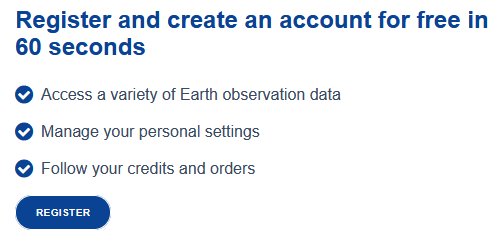
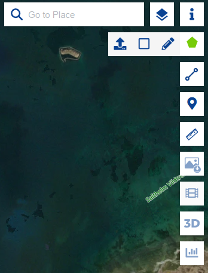
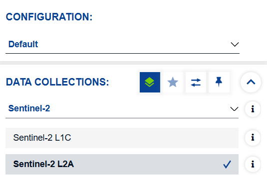
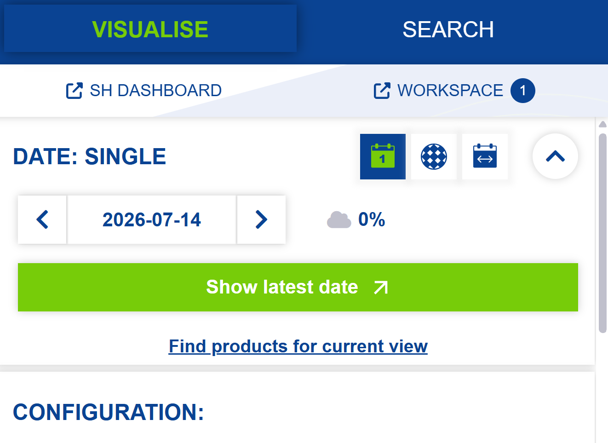
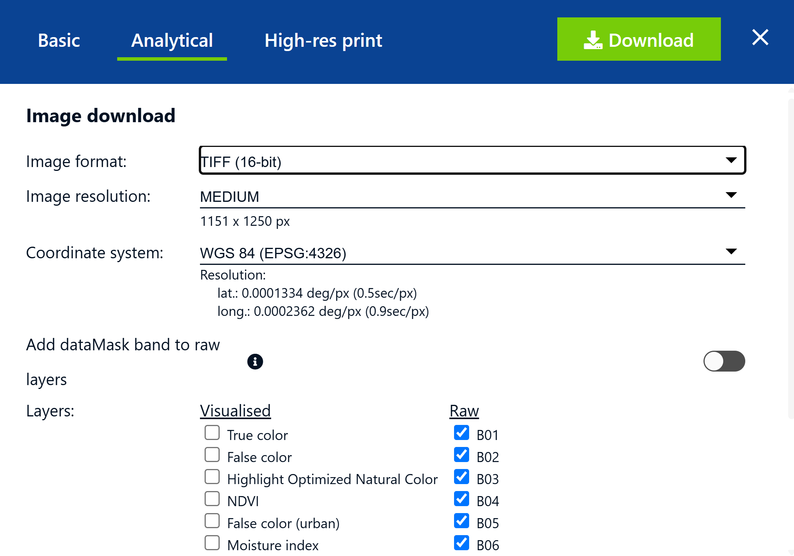
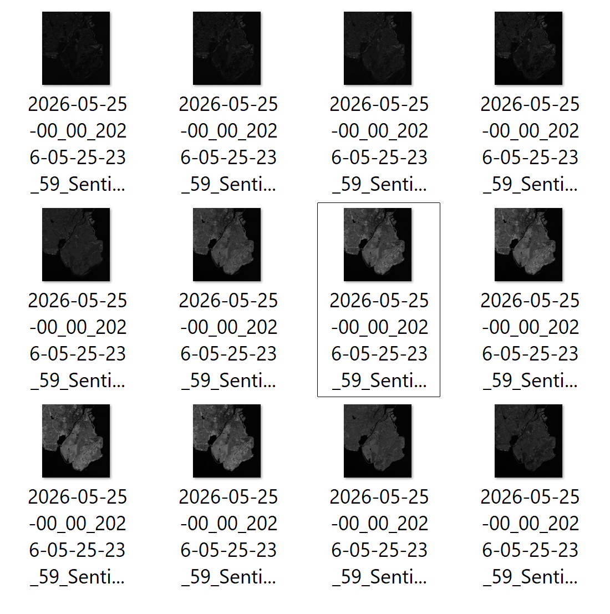

::: questions
-   How do I download satelite data from the Sentinel satelites?
:::

::: objectives
-   Be able to select specific areas of interest
-   Choose imaging from specific dates
- Choose specific spectral bands
:::

The Sentinel satelites are a family of earth observation satelites under the EU Copernicus programme. They collect data on, among other things, land, vegetation, oceans and climate. A lot of the data are freely available from the [Copernicus Browser](https://browser.dataspace.copernicus.eu/)

## Register as a user

A lot of the information from the Sentinel satelites are available without login, but in order to download data you will have to register as a user. It is free, although there are limitations on how much data you can download.

After navigating to the [Copernicus Browser website](https://browser.dataspace.copernicus.eu/), the first step is therefore to register as a user on the platform:

{width=50%}

Following the ordinary registry process including confirming your email, we are ready to locate the are we are interested in.

## Chose an area of interest

Zoom in on the area you are interested in. Depending on the specific satelite, and area, images will be recorded several times pr week. Those images are rather large, and although we can download the entire recording, we often download a smaller part of the image. This also make subsequent data manipulation easier and faster.

Click the pentagon in the right side. Chosing the square tools, we can select a square/rectangular area.

Here we have selected a part of the creater Copenhagen area. 

Next we select the data collection we want to work with. Several collections exist, and information about them are provided by clicking on the "i"-icon.

Here we chose the Sentinel-2 L2A collection. It contains multispectral recordings, corrected for atmospheric effects.

{width=50%}

We now select the date from which we want to retrieve data. We also chose a cloud cover of 0%. Note that the cloud cover is calculated based on the entire image. A cloud cover of 5% might be problematic if all the clouds are above the area of interest.

{width=50%}

Grey dates are dates where imaging exists, a blue frame indicate that imaging with the specified maximum cloud cover exists.

{width=50%}

After chosing a date, click the download image icon on the right

{width=50%}

In the dialogue box, select "Analytical". Chose image format, resolution and coordinate system, and chose the bands you want to download. For the purposes of introductory training here, B02, B03, B04 and B08 are enough.

{width=50%}

Finally click download. Data is downloaded as a zip-file. When that has been unzipped, the individual exposures are available.

{width=50%}

## Quotas

General users, that do not pay for the product, have limits on their use. 
Your current use can be found by clicking "SH DASHBOARD" in the left side of the screen. You get get 30 000 processing units and 30 000 requests each month. The math behind the use is a bit opaque. Making this set of training materials have used less than 10% of the monthly quota.

::: keypoints
-   To minimize the size of data, choose only the area needed
- Choose the spectral bands you need, instead of everything

:::