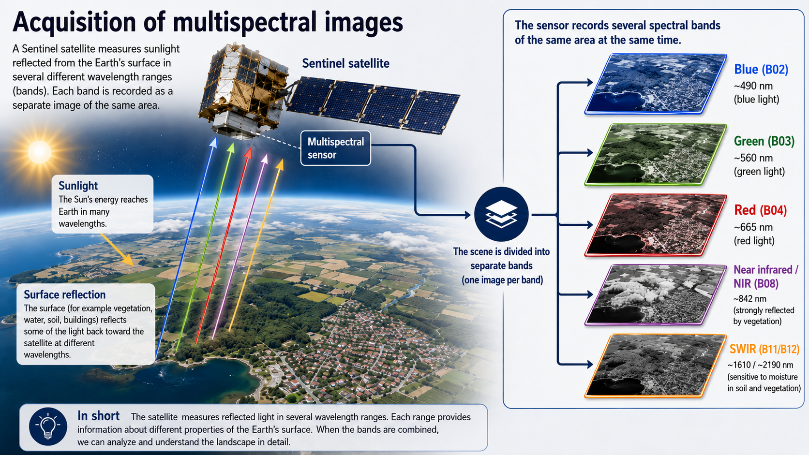

::: questions
-   FIXME
:::

::: objectives
-   FIXME
:::

We are going to work with spectral raster data from the European Sentinel satelites. These satelites capture images of the planet, recording reflected light from the 
surface in different spectral bands.

illustration of a sentinel satelite capturing multispectral data


[](fig/multispektral_imaging.png){target="_blank"}


## Get the data

In this session we are working with four specific bands:


| Band Number | Band Name | Central Wavelength (nm) | Bandwidth (nm)| File |
|-------------|--------------------------------|-----------------|--|--|
| B02      | Blue | 490    |65| [B02](https://raw.githubusercontent.com/KUBDatalab/R-toolbox/main/episodes/data/2026-05-25-00_00_2026-05-25-23_59_Sentinel-2_L2A_B02_(Raw).tiff) |
| B03      | Green | 560     |35| [B03](https://raw.githubusercontent.com/KUBDatalab/R-toolbox/main/episodes/data/2026-05-25-00_00_2026-05-25-23_59_Sentinel-2_L2A_B03_(Raw).tiff)|
| B04      | Red | 665     |30| [B04](https://raw.githubusercontent.com/KUBDatalab/R-toolbox/main/episodes/data/2026-05-25-00_00_2026-05-25-23_59_Sentinel-2_L2A_B04_(Raw).tiff)|
| B08      | Near Infrared (NIR) | 842     |15| [B08](https://raw.githubusercontent.com/KUBDatalab/R-toolbox/main/episodes/data/2026-05-25-00_00_2026-05-25-23_59_Sentinel-2_L2A_B08_(Raw).tiff) |

: Selected spectral bands from Sentinel 2. {#tbl-sentinel}

Download the files to a folder in your project named `data`, either manually from the links above, or by copy-pasting this code:

```{r download-files, eval = FALSE}

urls <- c("https://raw.githubusercontent.com/KUBDatalab/R-toolbox/main/episodes/data/2026-05-25-00_00_2026-05-25-23_59_Sentinel-2_L2A_B02_(Raw).tiff",
"https://raw.githubusercontent.com/KUBDatalab/R-toolbox/main/episodes/data/2026-05-25-00_00_2026-05-25-23_59_Sentinel-2_L2A_B03_(Raw).tiff",
"https://raw.githubusercontent.com/KUBDatalab/R-toolbox/main/episodes/data/2026-05-25-00_00_2026-05-25-23_59_Sentinel-2_L2A_B04_(Raw).tiff",
"https://raw.githubusercontent.com/KUBDatalab/R-toolbox/main/episodes/data/2026-05-25-00_00_2026-05-25-23_59_Sentinel-2_L2A_B08_(Raw).tiff")

download.file(
  urls,
  destfile = file.path("data", basename(urls)),
  mode = "wb"
)
```

These are raster data, containing cells, approximately 5 by 5 meters, with a recording of the reflected light in different wavelengths, depending on which file we are working with.

We are going to use the library `terra`, which provides methods for manipulating and working with spatial data.

After loading `terra`, we read in all four files using the `rast` function:

```{r read_files_demo, eval = FALSE}
library(terra)
files <- list.files("data/", pattern = ".tiff", full.names = TRUE)
sentinel <- rast(files)
```

```{r read_files_do, echo = FALSE, eval = TRUE, message = FALSE, warning = FALSE}
#read_demo_2
library(terra)

files <-  c("data/2026-05-25-00_00_2026-05-25-23_59_Sentinel-2_L2A_B02_(Raw).tiff",
"data/2026-05-25-00_00_2026-05-25-23_59_Sentinel-2_L2A_B03_(Raw).tiff",
"data/2026-05-25-00_00_2026-05-25-23_59_Sentinel-2_L2A_B04_(Raw).tiff",
"data/2026-05-25-00_00_2026-05-25-23_59_Sentinel-2_L2A_B08_(Raw).tiff")

sentinel <- rast(files)
```


## Looking at the data

The four files each contain a spectral band, and those four bands are now contained in one object, `sentinel`.

We can access the basic metadata simply by outputting the object:

```{r}
sentinel
```

The extent of the data and the resolution is given in degrees. One thing we can note is that the names are rather long.

We are going to work with individual layers in this object, and have to refer to their names. A renaming is therefore in order:

```{r}
names(sentinel) <- c("blue", "green", "red", "nir")
```


We can plot the individual layers:

```{r}
plot(sentinel[["blue"]])
```

And it is now revealed that we are working with data covering (part of) the Greater Copenhagen area.

:::: challenge
## Which of the four bands is the most distinct

Try plotting the four different bands, and decide which of them you think is the most distinct.

:::: solution
## Solution

What is the most distinct is of course a matter of taste, but some would argue that the NIR-band is the one that differs most from the others:

```{r}
plot(sentinel[["nir"]])
```


::::
::::

It might be useful to look at the summary of the data:

```{r}
summary(sentinel)
```

Note that spatial data is rather large - each layer in this case contains 4 295 016 cells or observations. By default the summary function for these spatial data objects only return summary data for a random sample of 100 000 observations.

:::: challenge
## What do we learn from the summary?

Discuss what information we gain from the summary?

:::: solution
## Solution

We observe that the values in each band in the object have values from approximately 0 to somewhere in the 65000's. The mean and medians of the three bands blue, green and red are relatively similarly, whereas the NIR-band have much larger values. 

We also get at strong indication that the raw data in this object, is probably not reflectances directly. The true values of reflectances would go from 0 - indicating no reflectance at all, to 1, indicating 100% reflectance.

This informs how we need to manipulate the raw data.

::::
::::


`summary` give us six different summary statistical parameters.

If we want other parameters we have to extract the raw data for reflectance. The easiest way is to use the `values()` function:

```{r}
sentinel[["blue"]] |> 
  values(mat = FALSE) |> 
  sd()
```

By default `values` extract the values as a matrix with one column. Adding `mat = FALSE`, makes it return the raw values as a numeric vector, that we can pipe to a function of our own choice.


:::: challenge
## Make a histogram of the values in the blue band

Extract the data using values. For a quick result you can use the base plot function `hist`


:::: solution
## Solution

```{r}
sentinel[["blue"]] |> values(mat = FALSE) |> hist()
```


Bonus: Try comparing with the NIR-band.

::::
::::


## Scaling the data

The data we get from Sentinel has been saved as a 16 bit tiff. That means that the reflectanse, which go from 0 - indicating no reflectanse at all, to 1 indicating 100% reflectance, has been encoded as a 16 bit integer, which go from 0 to 65535 (because 2^16 = 65536). This is an effect of choices made during download, so it is always neccesary to inspect the data and take its provenance into account.

In order to scale the raw data to values closer related to the physical world, we need to scale the data.

We do that by dividing all values by 65535. This is surprisingly simple:

```{r scaled_summary, warning = FALSE}
sentinel <- sentinel/65535

summary(sentinel)
```


:::: callout

Note that data from the Landsat family of satelites have to be scaled differently. Information on how is given in the [official documentation from USGS](https://www.usgs.gov/faqs/how-do-i-use-a-scale-factor-landsat-level-2-science-products){target="_blank"}.

Also note that we can acquire data from Sentinel, that is _not_ stored in 16 bit. In that case we will have to scale using a different parameter, or not at all.

::::

This does not affect the plot, but note the difference in scale:

```{r}
plot(sentinel[["blue"]])
```


Very dark plots

The plots are almost monochromatic. This is to be expected if we look at the histogram of values from the B02 band. Almost all observations are in the very low end. 50% of all observations are belov 0.05. When we plot using a color scale going from 0 to 1, half of the observations will get the darkest color. About 2/3 of the rest will get the second darkest color, and the higher value observations drown in a sea of blue.

One way of handling this can be to adjust the scale.

DET HER SKAL MÅSKE PILLES UD AF TIDSHENSYn.

```{r}
plot(
  sentinel[["blue"]],
  range = c(0.02, 0.17)
)
```

The range specifies, that the color scale should have a minimum at 0.02 reflectance, and a maximum at 0.17. Values lower than 0.02 will all get the same color, as will values higher than 0.17. This results in a larger difference in colors for the values in between, making it easier to see structure in the data.

The range is chosen to approximately exclude the 2% lowest and 2% highest values.

```{r}
sentinel[["blue"]] |> values(mat = FALSE) |> quantile(probs = c(0.02, 0.98))
```

For at gøre det hele lidt mere simpelt, har vi i  eksporten fravalgt "data mask" der ville fortælle os hvor evt. manglende værdier
måtte ligge.

This does not look like Copenhagen!

Well, it does, but we are only observing Copenhagen in one color. We have values for red, green and blue, and if we plot them together, we will get something that looks more like Copenhagen.

The `terra` package have a function specifically for that. We specify which band contains values for reflectance in the red part of the spectrum, green and blue:

```{r}
plotRGB(sentinel, r = 3, g = 2, b = 1,
  stretch = "lin")
```

`plotRGB` expects values for each band between 0 and 255. We have more physically relevant values, but the `stretch = "lin"` tells `plotRGB` to "stretch" these values to fit the range of 0 to 255.

What can we use this for?

False colour plots can make it easier to distinguish area with eg vegetation.

eller false colour composite

det efterlader vegetation rødt - fordi planters celle lag "spongy mesophyl" reflects NIR.


```{r}
plotRGB(sentinel, r = 4, g = 3, b = 2,
  stretch = "lin")

```

We can use these false colour composites to highlight what is in specific parts of the area we are investigating.

Øvlse 

hvad sker der hvis vi sætter g til at være nir og r til at være noget andet.

## What else can we use this for?

Different materials have different properties. Chlorophyl eg absorbs light in the red part of the spectrum. Therefore leaves reflect less red light. They also reflect strongly in the near-infrared part of the spectrum - because it is scatterede by internal structures in the leaves.

If we calculate the contrast between reflected red light, and NIR - we get an indication that what we are looking at, is vegetation.

A commonly used index is NDVI

$$
\text{NDVI} = \frac{\text{NIR} - \text{Red}}{\text{NIR} + \text{Red}}
$$

The signal we are looking for is high reflectances of NIR and low reflectance of red light. Other stuff reflects NIR, but if it also reflects red light, it is probably not vegetation, which does not reflect red ligt.

Dividing with the sum normalizes the index to go between -1 and 1, and it makes the value relative to the total signal in the two bands - making the measurement less dependent on light intensity.

We can calculate a new channel in the data

```{r}
ndvi <- (sentinel[["nir"]] - sentinel[["red"]])/(sentinel[["nir"]] + sentinel[["red"]])
```


The new object `ndvi` is a SpatRaster object just like `sentinel`
```{r}
ndvi
```

```{r}
plot(ndvi)
```

Setting a cutoff where we define areas with an NDVI value larger than 0.4 as vegetation, we can get a map of where there is vegetation in Copenhagen:
```{r}
plot(ndvi > 0.4)
```

We can also get an indication of how much of Copenhagen that is covered in vegetation. We first extract the values, compare them to 0.4, and calculate the mean, giving us the proprotion of cells in the map with an NDVI indicating vegetation:

```{r}
ndvi_values <- ndvi |> values(mat = FALSE) 
(ndvi_values > 0.4) |> mean(na.rm = TRUE)
```


## Simple classification


Rather than plotting the simple binary "larger than 0.4, yes/no" values, we would like a more differentiated plot.

Several classifications of vegetation based on NDVI-values exist, this is but one:


-1–0	Ratings below 0 typically indicate a complete lack of vegetation, such as barren ground or cities.
0–0.1	Very little vegetation, typically barren ground.
0.1–0.3	Sparse vegetation, such as scrubland or grass.
0.3–0.6	Moderate vegetation, like temperate forests; may also indicate unhealthy crops.
0.6–0.9	Typical range for healthy thriving crops.
0.9–1	Dense overgrown vegetation, such as rainforests.

https://www.cropler.io/blog-posts/ndvi-classification-understanding-vegetation-health

Making a SpatRaster object containing these categories is a bit more complicated than we are used to.

We need to make a reclassification matrix, indicating the intervals and the class:

```{r}
rcl <- matrix(
  c(
    -1.0, 0.0, 1,  # No vegetation
     0.0, 0.1, 2,  # Very little vegetation
     0.1, 0.3, 3,  # Sparse vegetation
     0.3, 0.6, 4,  # Moderate vegetation
     0.6, 0.9, 5,  # Healthy crops
     0.9, 1.0, 6   # Dense vegetation
  ),
  ncol = 3,
  byrow = TRUE
)
```

We can then make a new spatRaster object with the classifications using the `classify` function:

```{r}
ndvi_class <- classify(ndvi, rcl)
```

And then plot it:

```{r}
plot(ndvi_class)
```

The numbering can be replaced by class-names:

```{r}
levels(ndvi_class) <- data.frame(
  value = 1:6,
  class = c(
    "No vegetation",
    "Very little vegetation",
    "Sparse vegetation",
    "Moderate vegetation",
    "Healthy thriving crops",
    "Dense overgrown vegetation"
  )
)
```

```{r class_plot, warning = FALSE}
plot(ndvi_class)
```

And we can count how many cells we have in the object of the different categories:

```{r}
freq(ndvi_class)
```

```{r andel_area, message = FALSE}
library(dplyr)
freq(ndvi_class) |> 
    mutate(share = count/sum(count)*100)
```


::: keypoints
-   FIXME

:::