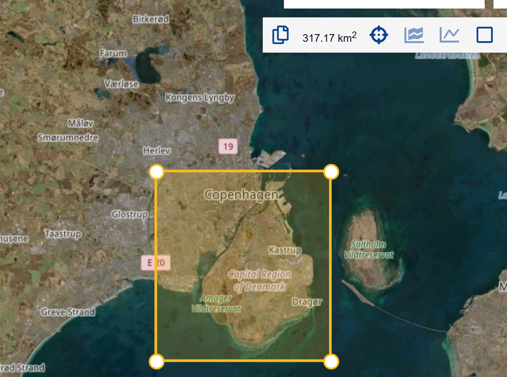
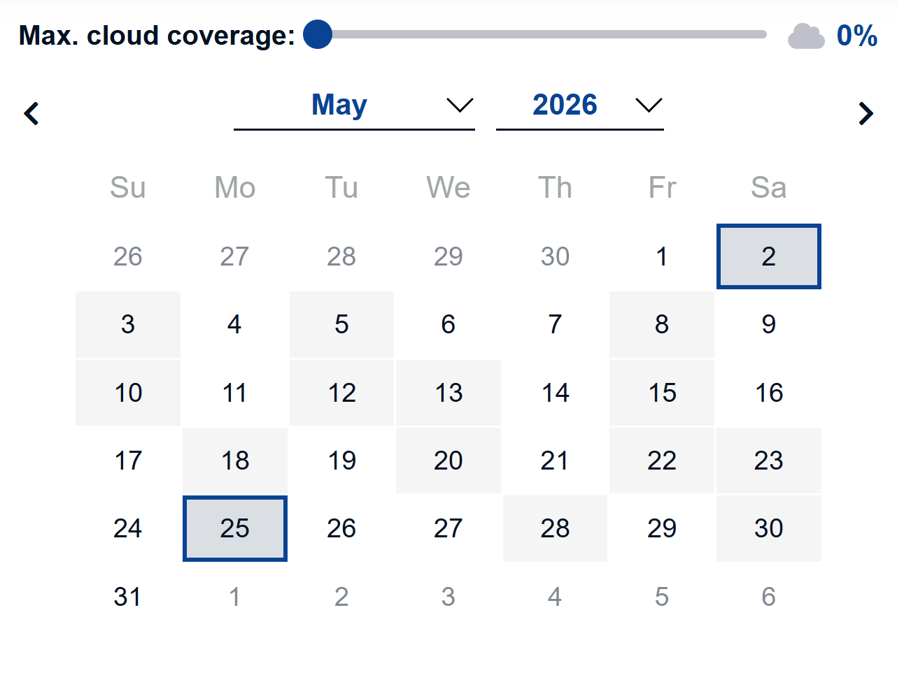
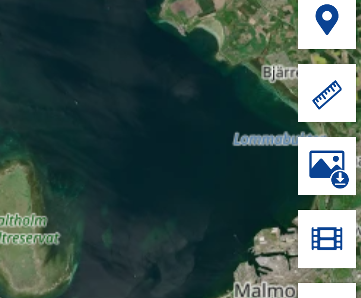

::: questions
-   How do I download satelite data from the Sentinel satelites?
:::

::: objectives
-   Be able to select specific areas of interest
-   Choose imaging from specific dates
- Choose specific spectral bands
:::

The Sentinel satelites are a family of earth observation satelites under the EU Copernicus programme. They collect data on, among other things, land, vegetation, oceans and climate. A lot of the data are freely available from the [Copernicus Browser](https://browser.dataspace.copernicus.eu/)

## Register as a user

A lot of the information from the Sentinel satelites are available without login, but in order to download data you will have to register as a user. It is free, although there are limitations on how much data you can download.

The first step is therefore to register as a user on the platform:

## Chose an area of interest

Zoom in on the area you are interested in. Depending on the specific satelite, and area, images will be recorded several times pr week. Those images are rather large, and although we can download the entire recording, we often download a smaller part of the image. This also make subsequent data manipulation easier and faster.

Here we select a part of the creater Copenhagen area. 

Vi vælger et udsnit af københavn. man akn se at vi har valgt 317 kvadratkilometer

husk - show more for at få alle bånd med. Klik download, og pak zip-filen ud!

## Quotas

https://browser.dataspace.copernicus.eu/

::: keypoints
-   To minimize the size of data, choose only the area needed
- Choose the spectral bands you need, instead of everything

:::