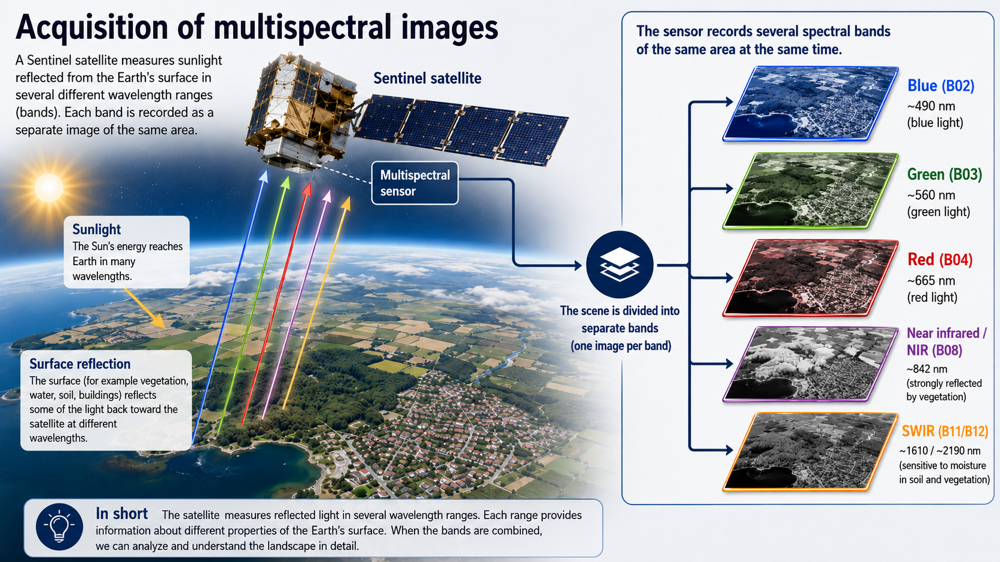

::: questions
-   FIXME
:::

::: objectives
-   FIXME
:::

We are going to work with spectral raster data from the European Sentinel satelites. 

{alt="illustration of a sentinel satelite capturing multispectral data"}

More specifically we are going to work with four specific bands:

| | Band Number | Band Name                      | Central Wavelength (nm) | Bandwidth (nm)|
|--|-------------|--------------------------------|-----------------|--|
|B02| Band 2      | Blue                           | 490    |65|
|B03| Band 3      | Green                          | 560     |35|
|B04| Band 4      | Red                            | 665     |30|
|B08| Band 8      | Near Infrared (NIR)            | 842     |15|

: Selected spectral bands from Sentinel 2. {#tbl-sentinel}

These are raster data, containing cells, approximately 5 by 5 meters, with a recording of the reflectance in different wavelengths, depending on which file we are working with.

The files can be downloaded here:

* [B02](https://raw.githubusercontent.com/KUBDatalab/R-toolbox/main/episodes/data/2026-05-25-00_00_2026-05-25-23_59_Sentinel-2_L2A_B02_(Raw).tiff)
* [B03](https://raw.githubusercontent.com/KUBDatalab/R-toolbox/main/episodes/data/2026-05-25-00_00_2026-05-25-23_59_Sentinel-2_L2A_B03_(Raw).tiff)
* [B04](https://raw.githubusercontent.com/KUBDatalab/R-toolbox/main/episodes/data/2026-05-25-00_00_2026-05-25-23_59_Sentinel-2_L2A_B04_(Raw).tiff)
* [B08](https://raw.githubusercontent.com/KUBDatalab/R-toolbox/main/episodes/data/2026-05-25-00_00_2026-05-25-23_59_Sentinel-2_L2A_B08_(Raw).tiff)

Download them to a folder in your project named `data`, either manually or by copy-pasting this code:

```{r download-files, eval = FALSE}

urls <- c("https://raw.githubusercontent.com/KUBDatalab/R-toolbox/main/episodes/data/2026-05-25-00_00_2026-05-25-23_59_Sentinel-2_L2A_B02_(Raw).tiff",
"https://raw.githubusercontent.com/KUBDatalab/R-toolbox/main/episodes/data/2026-05-25-00_00_2026-05-25-23_59_Sentinel-2_L2A_B03_(Raw).tiff",
"https://raw.githubusercontent.com/KUBDatalab/R-toolbox/main/episodes/data/2026-05-25-00_00_2026-05-25-23_59_Sentinel-2_L2A_B04_(Raw).tiff",
"https://raw.githubusercontent.com/KUBDatalab/R-toolbox/main/episodes/data/2026-05-25-00_00_2026-05-25-23_59_Sentinel-2_L2A_B08_(Raw).tiff")

download.file(
  urls,
  destfile = file.path("data", basename(urls)),
  mode = "wb"
)
```


The next step is reading the data into memory. Rather than importing each file separately, we can read in all files in one go:

```{r eval = FALSE}
library(terra)
files <- list.files("data/", pattern = ".tiff", full.names = TRUE)
sentinel <- rast(files)
```

```{r echo = FALSE}
library(terra)
files <- 

files <- c("data/2026-05-25-00_00_2026-05-25-23_59_Sentinel-2_L2A_B02_(Raw).tiff",
"data/data/2026-05-25-00_00_2026-05-25-23_59_Sentinel-2_L2A_B03_(Raw).tiff",
"data/2026-05-25-00_00_2026-05-25-23_59_Sentinel-2_L2A_B04_(Raw).tiff",
"data/2026-05-25-00_00_2026-05-25-23_59_Sentinel-2_L2A_B08_(Raw).tiff")
sentinel <- rast(files)
```


Basic metadata:

```{r}
sentinel
```

Vi indlæser et af billederne, og plotter det. Og de andre - og så samler vi rgb til et farvebillede.

Vi plotter også nir.

falske farver - hvor vi kan illustrere vegetation ved at placere grøn i rød kanal.

og ndvi indexet. Det behøver vi ikke forklare i mange detaljer - andet end at kloge mennesker har fundet ud af at grønne planter reflekterer på en måde der gør at det maksimerer i det index.

statistical summary og data processing - hvordan ser data ud, og hvordan skalerer vi.

Thresholding

Simple classification


freq(ndvi_class, bylayer = FALSE) som giver os et bud på fordelingen af de forskellige kategorier af vegetation

Øvelser


::: keypoints
-   FIXME

:::