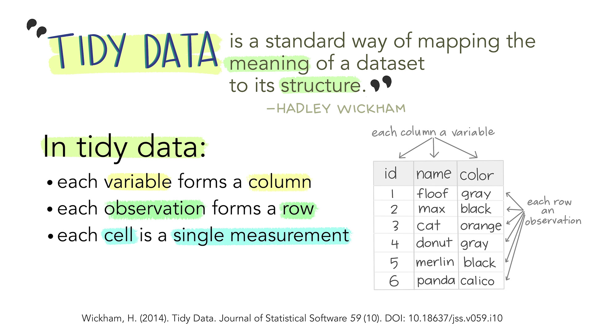

::: questions
- What makes a tabular dataset tidy?
- How can information stored in column names or table layout be converted into variables?
- Why does data structure affect later analysis?
:::

::: objectives
- Diagnose common violations of the tidy-data principles.
- Reshape datasets with pivot_longer() and pivot_wider().
- Separate compound variables into individual columns.
- Design spreadsheets that can be imported and analysed without manual restructuring.
:::

```{r setup}
#| include: false
library(tidyr)
library(dplyr)
```


## Introduction

Most of what we want to do with our data is relatively simple. *If* the data is 
structured in the right way.

Working within the paradigm of `tidyverse` it is preferable if the data is *tidy*.

{alt='Illustration showing that well-structured data makes analysis easier'}


Tidy data is not the opposite of messy data. Data can be nice and well 
structured, tidy as in non-messy, without being tidy in the way we understand 
it in this context.

{alt='Illustration distinguishing tidy data from data that merely looks neat'}


Tidy data in the world of R, especially the dialect of R we call tidyverse, 
are characterized by:

-   Each variable is a column; each column is a variable.
-   Each observation is a row; each row is an observation.
-   Each value is a cell; each cell is a single value.

{alt='Diagram showing tidy data with variables in columns, observations in rows, and values in cells'}

This way of structuring our data is useful not only in R, but also in other 
software packages. 

## An examples

This is an example of untidy data, on new cases of tubercolosis in Afghanistan.
It is well structured, however there are information in the column names.

"new_sp_m014" describes "new" cases. Diagnosed with the "sp" method (culturing 
a sample of sputum and identifying the presence of Mycobacterium Tuberculosis 
bacteria). In "m" meaning males, between the ages of 0 and 14.

Picking out information on all new cases eg. distribution between the two sexes
is difficult. Similar problems arise if we want to follow the total number
of new cases.

```{r example_of_problems}
#| echo: false
who |> select(country, year, new_sp_m014:new_sp_m3544) |> filter(year >= 2000,year<=2009) |> slice(1:10)
```

Getting this data on a tidy format is not trivial, but a resulting, tidy, 
organised dataset would look something like this:

```{r tidying_who}
#| echo: false
who |> 
  select(country, year, new_sp_m014:new_sp_m3544) |> 
  filter(year >= 2000,year<=2009) |> 
  slice(1:10) |> 
  pivot_longer(new_sp_m014:new_sp_m3544, names_to = "var", values_to = "cases") |> 
  separate_wider_delim(cols = var, delim = "_", names = c("new", "method", "var")) |> 
  separate(var, sep = 1, into=c("sex", "age_group")) |> 
  mutate(age_group = sub("^(\\d{1,2})(\\d{2})$", "\\1-\\2", age_group)) |> 
mutate(across(where(is.character), factor))
```

The fact that we are recording "new" cases is now a variable in it self. The
method used is also a variable, and the categorical variabel sex is similarly 
a separate variable as is the age group.

The variables `new`, `method` and `sex` might appear redundant - all values
are identical, however the entire dataset contains data on non-new cases, other
methods for diagnosis and the other sex, recorded as "f".

## Do's and dont's in Excel

Excel is a very useful tool, especially for collecting data.

But even though we are able to do everything we can do in R, in Excel, we 
will normally do the main part of our work with data in R. 

It is therefor a very good idea to think about how we collect and organise the 
data in Excel, to make our life easier later on.

We have collected some good rules of thumb for structuring data in Excel, based
on time-consuming and traumatic experiences wrangling data from Excel to R.

**Always**

* Use one column for one variable
* Use one row for one observation
* Use one cell for one value
* Begin your data in the upper left corner (cell A1)
* Use one sheet for each type of data


**Never (EVER!)**

* Modify your raw data - always make a copy before making any change
* Merge cells
* Use colours for information


Illustrations from the Openscapes blog Tidy Data for reproducibility, efficiency, and collaboration by Julia Lowndes and Allison Horst

::: keypoints
- Each variable should occupy one column, each observation one row, and each value one cell.
- Information encoded in headers, colours, or layout should generally become explicit values.
- Tidy structure simplifies transformation, visualisation, modelling, and reuse.
:::
