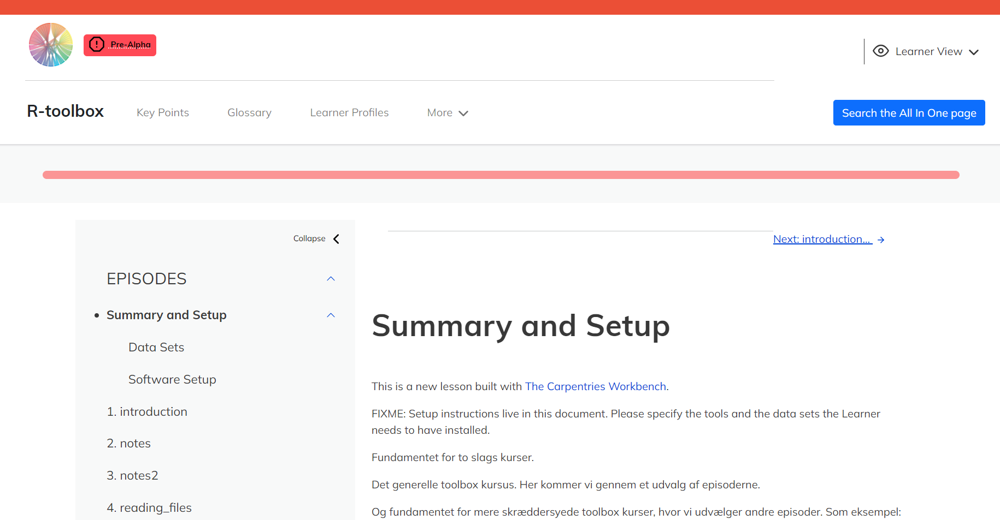

```{r setup, include=FALSE}
knitr::opts_chunk$set(echo = FALSE,
                      warning = FALSE,
                      tidy = FALSE,
                      message = FALSE,
                      fig.align = 'center',
                      out.width = "100%")
options(knitr.table.format = "html") 
knitr::opts_knit$set(clean = TRUE)
```

# Introduktion


KUB Datalab får regelmæssigt forespørgsler fra studerende med ønske om kurser
med _meget_ specifikt indhold. Det er for omkostningsfuldt at skulle udvikle
enkeltstående kurser hvis egentlig indhold er en gentagelse af den undervisning
de har fået i et kursus på universitetet, men som har voldt dem problemer. 

Vi har derfor udviklet et generelt "værktøjskassekursus", med elementer der hyppigt
er efterspørgsel på. På baggrund af disse lego-klodser kan vi hurtigt sammensætte
et tilrettet kursus der matcher de specifikke ønsker i en given situation.


```{r, include=FALSE}
knitr::write_bib(c('posterdown', 'rmarkdown','pagedown'), 'packages.bib')
```

# Infrastruktur

Kurset er opbygget i Workbench infrastrukturen fra Carpentries [@TheCarpentries] 
med brug af sandpaper [@sandpaper] pakken, og tilgængeliggjort på GitHub.


<!-- pagedown	pagedown::chrome_print("myfile.Rmd") -->

Hvordan bygger vi så hurtigt et kursus?

klon siden, rediger config.yaml, PR - og så er den der.


# Methods

Kursets didaktiske tilgang er baseret på teaching tech together. code-along
etc.

I will show here how to include poster elements that may be useful, such as an equation using mathjax:

$$
E = mc^2
$$
```{r pressure, echo=FALSE, fig.cap="A caption", out.width = '100%'}

```


To get a better understanding of how to include features like these please refer to the {posterdown} [wiki](https://github.com/posterdown/wiki).

**_Now on to the results!_**

# Indhold

Tematiseret episodeliste


Here you may have some figures to show off, bellow I have made a scatterplot with the infamous Iris dataset and I can even reference to the figure automatically like this, `Figure \@ref(fig:irisfigure)`, Figure \@ref(fig:irisfigure).

```{r, irisfigure, fig.cap='Here is a caption for the figure. This can be added by using the "fig.cap" option in the r code chunk options, see this [link](https://yihui.name/knitr/options/#plots) from the legend himself, [Yihui Xie](https://twitter.com/xieyihui).', out.width="80%"}
par(mar=c(2,2,0,1))
plot(x = iris$Sepal.Length, y = iris$Sepal.Width,
     col = iris$Species, pch = 19, xlab = "Sepal Length",
     ylab = "Sepal Width")
```

Maybe you want to show off some of that fancy code you spent so much time on to make that figure, well you can do that too! Just use the `echo=TRUE` option in the r code chunk options, Figure \@ref(fig:myprettycode)!

```{r myprettycode, echo=TRUE, fig.cap='Boxplots, so hot right now!', fig.height=6, out.width="80%"}
#trim whitespace
par(mar=c(2,2,0,0))
#plot boxplots
boxplot(iris$Sepal.Width~iris$Species,
        col = "#008080", 
        border = "#0b4545",
        ylab = "Sepal Width (cm)",
        xlab = "Species")
```

How about a neat table of data? See, Table \@ref(tab:iristable):

```{r, iristable}
knitr::kable(
  iris[1:15,1:5], format = "html",
  caption = "A table made with the **knitr::kable** function.",
  align = "c", col.names = c("Sepal <br> Length",
                             "Sepal <br> Width",
                             "Petal <br> Length",
                             "Petal <br> Width",
                             "Species"),
  escape = FALSE)
```


```{r pingviner, echo=FALSE, fig.cap="palmer penguins hexsticker -Artwork by @allison_horst ", out.width = '20%'}
knitr::include_graphics("../figure/palmerpenguins.png")
```

## Et praktisk eksemepel

Panum UngdomsForsker Forening, PUFF, er en studenterforening drevet af frivillige
medicinstuderende på Københavns Universitet, der arbejder for at forbedre vilkårene
for medicinsk studenterforskning. 

PUFF har gennem flere år tilbudt et kursus i statistisk metode & det statistiske
programmeringssprog R. Kurset blev gennemført over 5 eftermiddage/aftener á 3 timer,
og med en professor i biomedicinsk statistik som underviser. Efter COVID-19 
pandemien oplevede de vanskeligheder med at tiltrække deltagere til det relativt
dyre kursus.
at tiltrække 

## Hvor finder du den?
https://github.com/kubdatalab/R-toolbox

https://kubdatalab.github.io/R-toolbox/

# Referencer
