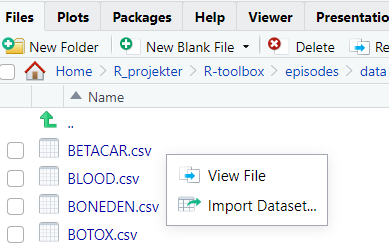
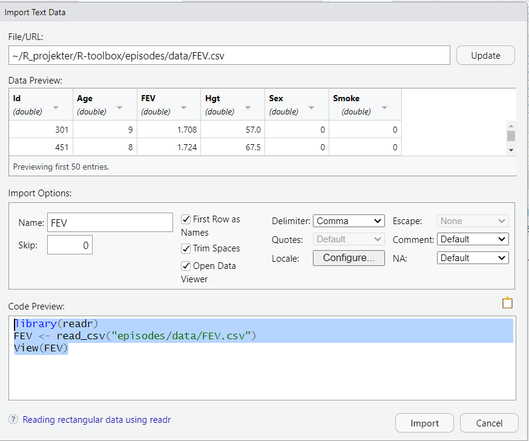

::: questions
-   How do you read in data from files??
:::

::: objectives
-   Explain how to read in data from a selection of different data
    files.
:::

## Introduction

The first step of doing dataanalysis, is normally to read in the data.

Data can come from many different sources, and it is practically
impossible to cover every possible format. Here we cover some of the
more common.

::: instructor
The most important point is that there is a very high probability that
at least one package exists that is designed to read a specific weird
data format.
:::


## Use code!

RStudio makes it simple to load most common data formats: Click on
the file in the "Files" tab in RStudio, and choose "Import Dataset":




RStudio will then provide an interface for loading the data:



However in general we prefer to have a script or a document, that can be
run without us pointing and clicking. So - instead of importing the data
in this way, copy the code that RStudio uses to import the data, and
paste it into your script or document.

## CSV-files

The most basic file type for storing and transferring data. A "simple"
textfile, containing tabular data. One line of text for each row of
data, each cell in that row, corresponding to a column, separated with a
separator, typically a comma.

Many languages use commas as decimal separators. That neccesitates an
option for using something else than a comma. Typically a semicolon.

### Truly commaseparated files

Use `read.csv()` (from base-R) or `read_csv()` (from `readr`, included
in `tidyverse`)

We recommend using `read_csv()`.

### Semicolon separated files

Use `read.csv2()` (from base-R) or `read_csv2()` (from `readr`, included
in `tidyverse`)

We recommend `read_csv2()`

### What they have in common

`read_csv` and `read_csv2` take a lot of arguments that can control
datatypes, handling of headers etc. For most use, the default options
are enough, but if you need to adjust something, there are plenty of
options for that.

:::: discussion
## guess_max

`read_csv` and `read_csv2` tries to guess the datatypes in the file, and
will convert the data accordingly. That will return a dataframe where
date-time data is stored as such. The functions by default reads the
first 1000 rows, and makes a guess on the datatype based on that.

That can lead to problems if the first 1000 rows of a column contain
numbers, and row 1001 contains text. In that case the entire row will be
coerced to `numeric`, and the following rows will contain `NA` values.
Adjust the argument `guess_max` to something larger to catch this
problem.

To include every row in the guess, add `guess_max = Inf` - but be
careful if you have a very large dataset.

::::

## Excel-files

Use the `readxl` package. Excel comes in two variants, `xls` and `xlsx`.
`read_excel()` makes a qualified quess of the actual type your
excel-file is. Should we need to specify, we can use `read_xls()` or
`read_xlsx()`.

Workbooks often contains more than one sheet. We can specify which we
want to read in:

`read_excel(path = "filename", sheet = 2)`

Which will read in sheet number 2 from the workbook "filename".

Read the documentation for details on how to read in specific cells or
ranges.

## SPSS

SPSS, originally "Statistical Package for the Social Sciences", later
renamed "Statistical Product and Service Solutions" is a proprietary
statistical software suite developed by IBM.

Not surprisingly it is widely used in social science.

The package `haven` supports reading SPSS (Stata and SAS) files

Use the package to read in spss files:


``` r
library(haven)
read_spss("filename")
```

The function returns at tibble.

Note that SPSS uses a variety of different formats. `read_spss()` will
make a guess of the correct format, but if problems arise, try using one
of the other functions provided in `haven`

## Stata

Stata is a proprietary statistical software package, used in a multitude
of different fields, primarily biomedicine, epidemiololy, sociology and
economics.

As mentioned above, hte `haven` package provides functions for reading
Stata files:


``` r
library(haven)
read_stata("filename")
```

The function returns at tibble.

As with SPSS Stata uses a couple of different fileformats, and
`read_stata` makes a guess as to which format is used. If problems
arise, `haven` has more specific functions for reading specific file
formats.

## SAS

SAS is a proprietary statistical software suite developed by SAS
Institute.

As mentioned above the package `haven` can read SAS-files:


``` r
library(haven)
read_sas("filename")
```

The function returns at tibble.

As with SPSS and Stata, SAS uses a couple of different fileformats, and
`read_sas` tries to guess the correct format.

If problems arise, `haven` has more specific functions for reading
specific file formats.

## JSON

Not all data come in a nice rectangular format:

+-------------------------------------+--------------+----------------+
| Country                             | Name         | Phonenumber    |
+=====================================+==============+================+
| USA                                 | NASA         | (713) 483-3111 |
+-------------------------------------+--------------+----------------+
|                                     | White House  | (202) 456-1414 |
|                                     |              |                |
|                                     |              | (202)-456-1111 |
+-------------------------------------+--------------+----------------+
| Russia                              | Kremlin      | 0107-095-295-9051 |
+-------------------------------------+--------------+----------------+
| Vatican                             | The Pope     | 011-39-6-6982  |
+-------------------------------------+--------------+----------------+

There are two locations in the US, and one of them have two phonenumbers.
These kinds of structure, where one row contains data with more than one
row (etc), are called nested, and are typically stored or distributed in the
JSON-format.

JSON can be read using `fromJSON()` from the `jsonlite` library.

``` r
library(jsonlite)
fromJSON("filename")
```

Note that you will end up with nested columns - containing lists - which you 
probably will have to handle afterwards.


## Other formats

In general if a piece of software is in widespread enough use that you
encounter the weird file-format it uses, someone will have written a
package for reading it. Google is your friend here!

Also, if you encounter a really weird dataformat, please send us an
example so we can expand our knowledge.

::: keypoints
-   The `readr` version of `read_csv()` is preferred
-   Remember that csv is not always actually separated with commas.
-   The `haven` package contains functions for reading common
    proprietary file formats.
-   In general a package will exist for reading strange datatypes.
    Google is your friend!
-   Use code to read in your data
:::
