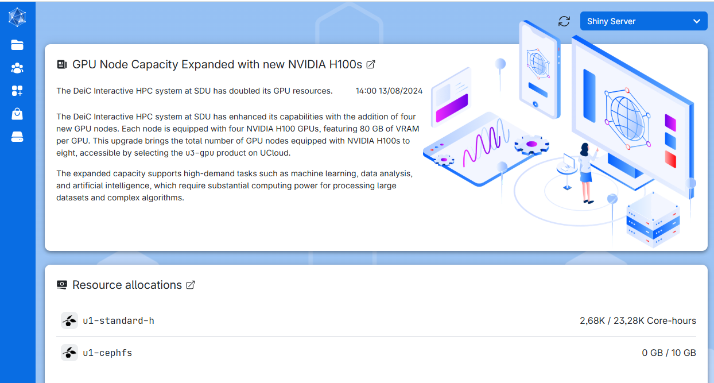
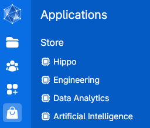
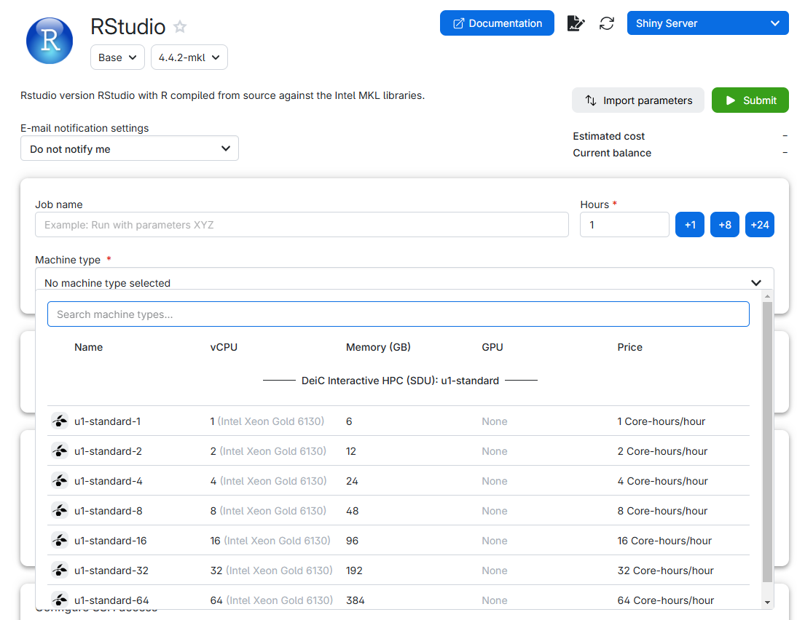
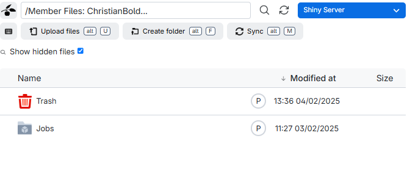
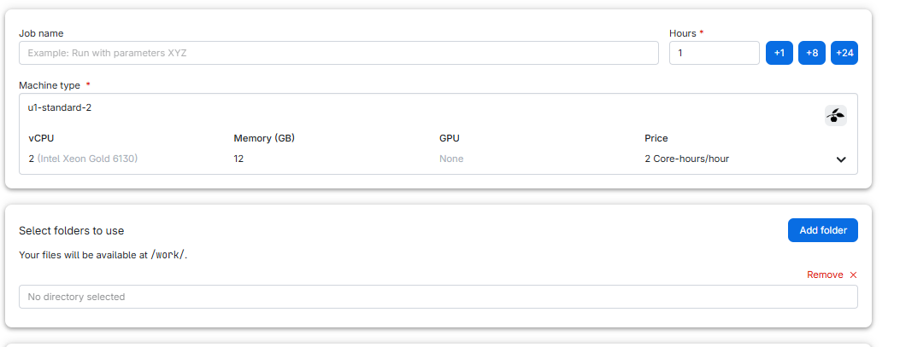
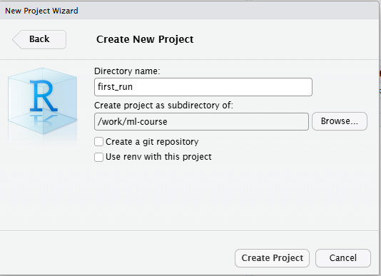
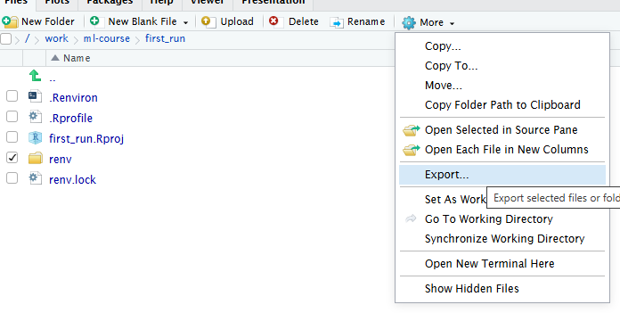
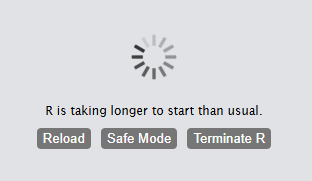

:::::::::::::::::::::::::::::::::::::: questions 

- What is Ucloud?
- How do we use R and RStudio on Ucloud?

::::::::::::::::::::::::::::::::::::::::::::::::

::::::::::::::::::::::::::::::::::::: objectives

- Explain how to acces RStudio and R on Ucloud
- Demonstrate how to setup drives and additional software working with Ucloud

::::::::::::::::::::::::::::::::::::::::::::::::


You need to run R on a computer that have more muscles than you own. 

If you are a student at UCPH, you are in luck, because you have access to a 
High Performance Computing (HPC) facility;
ucloud. It can be acessed at cloud.sdu.dk using the normal UCPH login and 
password.


Depending on the user allowances, it will look something like this.



Ucloud provides access to a multitude of different applications organized in the
application store:



Amongst the more popular picks from the store is RStudio:


This allow us to start a session of RStudio, accessible in the browser. 





Note that we can chose different machine types. Parallel processing is not 
the solution to every problem, but sometimes it is, and here we get access to a
_lot_ of cores.

You select a suitable type of machine, chose how long you want it to run, 
click submit, and after a short wait, you
can click "Interface", and you will have, in your browser, something that looks
almost exactly like RStudio.

## This is not a computer as such

What we can start is not a computer. It is a virtual machine. A virtual machine 
is not a real computer, it is a simulation of a computer, that runs on a larger
computer. Rather than installing an operating system and software on a real 
computer, we ask the larger computer to start a simulation of a 
computer. Since we interact with it through the web, we might not discover the
difference. But there are some, which are important to know about.

### Compute

Running a virtual computer on a HPC-facility gives us access to a lot of resources,
primarily "CPU"s and "RAM".

Your own computer have a CPU. It is the physical unit that actually runs your 
code. When we ask R to calculate `1+1`, it is the CPU that does the calculation.

Most modern CPU have multiple "cores". So in reality it is not the CPU that actually
performs the calculation, it is one of the cores in the CPU. 

The computer used for writing this text have 20 cores.

This is nice, for the core can - in principle - only do one calculation at a time.
When we calculate `1+1`, that is the only thing the core can do at that precise moment.

The thruth is a lot more complicated, but the analogy is useful in order to understand
why it can be nice to have more than one.

Having access to more than one core allow us to run some of our calculations in
parallel. If you are asked to do 10 simple multiplications, you are finished
when you have done 10 multiplications. Ask a friend to help, and do 5 yourself,
and let your friend do 5 - you will be done in half the time. 

Some calculations we want to do in R can be parallelized, where we ask one core 
to distribute the tasks to 10 different cores. The calculation will then be done
much faster, than if only one core worked on the problem.

Chosing a machine on Ucloud with a lot of cores will not necesarily speed up
your work. The code you run will have to be written to make use of all the cores.
And sometimes it takes longer to do that, than just leaving all the work to a
single core.

How do we find out how many cores we have? It should be simple. The library `parallel` have
a function `detectCores()` that returns the number of cores we have access to:


``` r
parallel::detectCores()
```

Reading the documentation reveals that it is not that simple:

"Where virtual machines are in use, one would hope that the result for logical = TRUE represents the number of CPUs available (or potentially available) to that particular VM."

Or use this:


``` r
future::availableCores()
```


### Memory

Looking at the interface, we see that we also get access to more memory, or RAM.

RAM is the short term memory of the 
computer. If we want to manipulate 10 Gb data, we need to be able to have
10 Gb of data in the memory of the computer. And we probably need to have
access to much more than 10 Gb, because R likes to use a lot of memory, and 
tends to make a copy of the data it manipulates.

We might therefore have to chose a certain size of virtual machine, not because
we actually need 64 cores, but because we need the memory.


### It will go away!

Because we are running a virtual computer, rather than a real computer, most of 
what we do will disappear when we restart the computer. In R we typically 
installs a number of libraries or packages. Those will vanish into thin air when
the virtual machine is closed down. In a section below we will cover access to
drives on Ucloud which to a certain degree can help us. But if we do not take
precautions, we will have to install R-packages every time we start up a 
new virtual machine on Ucloud

### Cost

We might be tempted to let the virtual machine run forever, instead of only for
1 hour. But Ucloud is a limited resource, and we only have a specific allowance 
in total. Running a machine with one virutal CPU for one hour consumes 1 "core-hour"
of our allowance. Running a machine with 64 virtual CPUs for one hour consumes 
64 core-hours. And when we run out of allowance - the machine will close down.

It will also close down when the time we chose ran out.

Therefore, do not request more cores than you actually need.

On the other hand, do not request less than you need. If you chose 1 CPU, with 
6 Gb RAM, and discover that you actually needed 12 Gb RAM - you will have to 
shut down the virtual machine, and start a larger. 

And because we are not running on a real computer, everything will be lost.

### Your drive

Not all is lost when you restart a virtual machine. Ucloud provides you
with a drive:


In it we find a listing of what is in our drive:


The folder "Jobs" contains data from the individual runs of virtual machines you
have done. And Trash contains deleted files. 

Note that the content of both these folders counts towards the total storage
you have available - so consider deleting them regularly.

It is recommended to create a folder for your work. Choose "Create folder" and
give it a name. For this example we will call it "ml-course".


:::: caution

Do not use white spaces in your folder or file names. Most programming languages 
are able to handle them, but will almost always require special steps to be taken. 
Having white spaces in file names introduces a potential for problems that can
be difficult to identify and fix.

::::


## Lets get started!

Go to the app-store as shown above, and chose RStudio.

Chose the "u1-standard-2" machinetype with 2 virtual CPUs and 12 GB memory.

In order to be able to access our files, go to "Select folders to use" and 
click add folder:



Click in "No directory selected" and then on "Use" to choose "ml-course":


And than click "Submit"

Your request is being processed:


And after a short while, you get this:


We can see what type of machine we chose, and how much time is remaining. 
We chose 1 hour, and we can extend the runtime by 1, 8 or 24 hours.

We can also see the "Open interface" button.

If we click that, RStudio opens and we can begin working with R.


The very first thing we should always do, is to create a project. At the 
upper right hand corner we see where we can do that: 


Click new project, create it in a "new Directory" and change the subdirectory
in which the project is created to the directory we made earlier. THIS IS IMPORTANT!



We now have a project running in RStudio on a virtual machine on UCloud, and
we are ready to work!


## Housekeeping

### What to do if RStudio appears to freeze?

First of all - have patience. RStudio appears almost the same when it is frozen
and if it is working on something that takes time. But take advantadge of the
fact that this is just a web interface to what is actually running on a 
virtual remote machine. Close the interface, and open it again. R will still be 
there.

### Where can I find the job again?

Sometimes we close a window, or nagivate away from it. Where can we find it again?
In the navigationbar to the left in Ucloud we find this icon. 

It provides us with a list or running jobs (yes, we can have more than one). Click
on the job, and we get back to the job, where we can extend time or open the 
interface again.

### I'm done early - how do I stop the job?

If you are done with your work, and there is no reason to continue running 
the machine, you can stop it early. Find the job (see above), and click and hold
the "Stop application" button. Remember to save your scripts in RStudio first!


- how to download an entire folder, so they can download their work at the end of the semester (without having to learn how to sync folders, which I imagine will be too much to ask from this workshop)
archiver...

### How do I get files out of UCloud?

This can be done in several different ways. Ucloud provides guides on how to
syncronise files. And there are archiving tools that can zip and download 
your files.

The easy way is to do it through RStudio. Select the folder and/or files you
want to save, click on the little cogwheel saying "More" and chose "Export".
RStudio will now zip the files, and ask you where to save them.


### How do I get files into UCloud

Again - Ucloud have services that can assist. But the easiest way is to
note that there is an "Upload" button in the Files pane in RStudio. Use that.


### What types of machines did I have access to?

UCloud offers the possibility of "projects" where you choices might be different.
If you're not in a "project" these will be the default options:

| name | vcpu |  memory (GB) |
|------|------|-------------|
| u1-standard-1 |  1  | 6 | 
| u1-standard-2 |  2|   12 | 
| u1-standard-4 |  4|  24| 
| u1-standard-8 |  8|   48| 
| u1-standard-16  | 16|   96| 
| u1-standard-32 | 32 | 192| 
| u1-standard-64 | 64 | 384| 


## Setup issues

We can save our work, and as long as we do not delete it again, we have
access to it. And keeping stuff in a project in R makes everything easy(ish) to
locate.

That, in general works nicely on a "real" computer, where libraries and other
elements of what we work with is saved locally. 

On a virtual computer, locally is in the memory of a larger computer, and
as hinted at, these locally stored files disappear when the virtual machine is
restarted.

If you usually start your code with `library(tidyverse)`, you will, on a virtual
machine, have to start with `install.packages("tidyverse")` instead. _Every time!_

Working with machine learning makes this even worse. Many of the algorithms we
work with requires us to have specific Python libraries installed, and
available to R. They also disappear.

And to complicate matters even more, some of them require specific versions of
Python, and are unable to run on the newest version. And by default the version 
of Python on Ucloud is the newest.

Below we present two ways of handling this. First "The Good Solution". Which could
be better. And "The Sledgehammer Solution". Which is the reason we call "The Good
Solution" good.


## The Good Solution

First of all, and _this is important!_ you chose the folder we demonstrated
how to use earlier:


The method requires the setup to know exactly where your files are.

Secondly, and for the same reason, you _must_ create a project in the folder 
you attached to the run of the virtual machine. 

Then make a script-file. It is not important what you call it, here we 
call it "setup.R"

Copy the code below into that file, and run the code _line-by-line_.

Some of the lines of code restart R. This is necessary for R to read-in new
options and settings. And when R is restarted, it does not know where to continue.


``` r
# Set path to renv cache
writeLines('RENV_PATHS_CACHE = "renv/cache"', ".Renviron")
# restart R in order to set the environment variable
.rs.restartR()

# Initializing renv. You will be asked if you want to do it. You do.
renv::init()

# Yes, it should be possible to do this in one go. 
# It fails. So, three lines of code...
renv::install("reticulate", prompt = FALSE)
renv::install('rstudio/tensorflow', prompt = FALSE)
renv::install("rstudio/keras", prompt = FALSE)

# Install miniconda - control where
reticulate::install_miniconda(path = "python_env")

# Storing information about installed packages
# You might be asked if you want to proceed. You do.
renv::snapshot()

# restart R to ensure that R knows where miniconda is installed
.rs.restartR()

# Create python environment
reticulate::conda_create(envname = "my_project_env", python_version = "3.10")

# Install Python packages in the environment
reticulate::conda_install(envname = "my_project_env", packages = c("numpy>=1.24", "pandas>=2.1", "tensorflow>=2.13", "keras>=2.13"))
reticulate::conda_install(envname = "my_project_env", packages = c("transformers>=4.30"))
reticulate::conda_install(envname = "my_project_env", packages = c("torch"), pip =TRUE)

# Restart R - this might not be necessary - we do it anyway
.rs.restartR()

# Specify which environment is to be used
reticulate::use_condaenv("my_project_env", required = TRUE)

# Storing information about installed packages
# You might be asked if you want to proceed. You do.
renv::snapshot()
```


One way to check that everything worked, is to run the following script:


``` r
.rs.restartR()
reticulate::use_condaenv("my_project_env", required = TRUE)
library(keras3)
model <- keras_model_sequential() %>%
  layer_dense(units = 32, input_shape = c(784)) %>%
  layer_activation("relu") %>%
  layer_dense(units = 10) %>%
  layer_activation("softmax")
summary(model)
```

If you get a nice summary, everything worked. You might get messages about
"ssl not installed". Those can be ignored. And you will also get warnings about
tensorflow not being compiled for working with "GPU"s. Since we do not have 
access to GPU on the kind of virtual machines we can run RStudio on, on UCloud,
these can safely be ignored.

#### Do I have to do this every time?

Good news everybody! No.

_If_ you start a new virtual machine, and add the _same_ folder in you drive
on Ucloud to the run, you can open your project again: Navigate to the project
folder (you did remember the name, right?), and click on the .Rproj file with 
the same name as your project. 

Due to the way Renv works, it might take some time to open the project:¨



And for reasons we do not entirely understand at KUB Datalab (yet), we also
have to run the 


``` r
.rs.restartR()
reticulate::use_condaenv("my_project_env", required = TRUE)
```

Before actually doing anything.


#### Other issues

Renv is a bit finicky. You might get messages about packages being in "an inconsistent
state". Try running this first:


``` r
renv::restore()
```

And if that does not solve the problem, try:


``` r
renv::rehash()
renv::snapshot()
renv::restore()
```

Sometimes renv forgets that a library is installed...

Fortunately the libraries are easily available, so an 

``` r
renv::install("rstudio/keras3")
```

is fast. The example shows keras3 - exchange the package name
for what is actually missing.

### The sledgehammer solution

This has worked consistently. But take a long time and needs to be repeated 
every time you start a new machine. It will work, but only by being pretty
violent with the virtual machine.

When you have started the virtual machine, and opened a project, make a new R-script
in the project, copy the following code (or download it from here), and run it
line by line.


``` r
# Run shell commands from R
system2("sudo", args = c("add-apt-repository", "-y", "ppa:deadsnakes/ppa"))
system2("sudo", args = c("apt-get", "update"))
system2("sudo", args = c("apt-get", "install", "-y", "python3.9", "python3.9-venv", "python3.9-dev"))

# Python setup
system2("python3.9", args = c("-m", "ensurepip", "--upgrade"))
system2("python3.9", args = c("-m", "pip", "install", "--upgrade", "pip"))
system2("python3.9", args = c("-m", "pip", "install", "numpy"))

# Create and activate environment
system2("python3.9", args = c("-m", "venv", "~/r-tensorflow"))

# Activate virtual environment and install packages
system2("bash", args = c("-c", "source ~/r-tensorflow/bin/activate && pip install numpy tensorflow keras spacy && python -m spacy download en_core_web_sm && deactivate"))

# R packages and setup
Sys.unsetenv('RETICULATE_PYTHON')
library(reticulate)
use_virtualenv('~/r-tensorflow', required = TRUE)

install.packages('remotes')
remotes::install_github('rstudio/tensorflow', upgrade = 'always')
library(tensorflow)
install_tensorflow(envname = '~/r-tensorflow', restart_session = FALSE)

remotes::install_github('rstudio/keras')
library(keras3)
install_keras(envname = '~/r-tensorflow')
```


You can check that it is working similarly to the better solution above.


## Notes on the good solution

Data analysis is not worth much, if we are not able to reproduce our results.
A significant amount of work have therefore gone into providing infrastructure
for exactly that. One issue is the question of which libraries are used for
the analysis.

Enter `renv`. `renv` is a library that establishes scaffolding for installing
libraries in a specific location in an R-project, making it self contained and
easy to distribute. Normally we would distribute a "lock file" that describes 
exactly which versions of which packages are used in a project. 


You will see a lot of stuff in the "files" tab. A folder called "renv", a file
"renv.lock", and probably a file ".Rprofile".

Looking into that, we will find a line of code "source("renv/activate.R")"

When ever we start the project, what ever we have written to 
.Rprofile will be run. What will be run in this case is the script "activate.R"
which does a lot of interesting stuff. The important thing is, that 
the renv-library is started. And whenever we now install a package, it 
will be installed in the renv folder. Do not delve too deep into that, leave it
to the machine.

One issue with this is, that there are still installed packages weird places 
on the machine. Caches of the packages are stored outside our project. The idea
is that other projects might use these cached packages, and cut down on install
time. 

In our case, that is not helpful. This cache will disappear when the virtual
machine is stopped.

In order to handle this, we can specify where the cache should be stored.
We can do that manually. Or, and this is the preffered solution, make a file
.Renviron where we specify where renv should place the cache. Having done that
we need to restart R, and now we can install packages to our hearts delight,
and renv will place both the libraries and the cache in our local project.

An example of a script that sets the environemt file, and installs a selection
of usefull pacakges can be found below. Note that this takes a very long time.
The alternative to this taking a very long time once, is for it to take a very
long time every time we open our project. 


::::::::::::::::::::::::::::::::::::: keypoints 

- Ucloud provide access to a multitude of advanced software that we are not able to run locally
- Running RStudio on Ucloud give us access to more compute and memory than we have on our own computer
- More advanced work might require a quite complicated setup
- Restarting a virtual machine means all our work and setup might be lost, unless we take certain precautions.

::::::::::::::::::::::::::::::::::::::::::::::::

